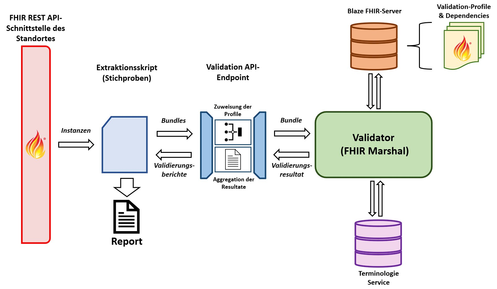

# ABIDE Validation
This project provides a validation service in order to validate FHIR data
with respects to data quality, the requirements of the FDPG network and to 
ascertain what codes and values are most commonly used at the different sites.
Accordingly, the goal is not merely to assess data quality but also to 
facilitate mediation regarding how data has to be structured and has to be 
recorded for it to conform to the requirements of the FDPG platform.

## Deployment
This section will explore the deployment in an exemplary environment to not only provide information on
how to run this tool itself, but also on how to integrate it into existing software infrastructure.

### Deploying the FHIR server
Before deploying this tool you need some FHIR server to which request can be made. This example will use
the [Blaze FHIR server](https://github.com/samply/blaze) which you can easily deploy using Docker with
the following commands:

```docker volume create blaze-data```

```docker run -d -p 8080:8080 -v blaze-data samply/blaze:0.18```

**NOTE:** Further documentation can be found [here](https://github.com/samply/blaze/blob/master/docs/deployment/docker-deployment.md)

### Uploading data to the FHIR server
Once the server is up and running you can upload your FHIR data to the server using the [FHIR REST API](https://www.hl7.org/fhir/http.html)
as implemented by every FHIR server. In the case of Blaze you can use the [blazectl tool](https://github.com/samply/blazectl).
It allows for easy data upload using the following command:

```blazectl upload <data_dir> --server <server_url>```

where **data_dir** is the directory your FHIR data in form of bundles (supported file formats can be found [here](https://github.com/samply/blazectl#upload))
and **server_url** is the URL of your FHIR server (in the case of this example it would be *http://localhost:8080/fhir*).

To obtain test data you can use the [KDS test data repository](https://github.com/medizininformatik-initiative/kerndatensatz-testdaten)
which you can grab by running 

```git clone https://github.com/medizininformatik-initiative/kerndatensatz-testdaten.git```

The repository contains the **Test_Data** folder which contains the FHIR bundles. To upload the contained data in this
example you would thus run

```blazectl upload kerndatensatz_testdaten/Test_Data --server http://localhost:8080/fhir```

to upload the data.

### Deploying the tool
Once your server is running and containing sufficient data the validation tool can be run to validate data on it. To
enable easy deployment on any system, the validation tool will be deployed using Docker. Grab the repository by running

```git clone https://github.com/medizininformatik-initiative/fdpg-query-data-validation.git```

and move into the project directory.

Before Deployment the *environment variables* have to be adjusted depending on the specific circumstance. They can be adjusted by changing 
their values in the **.env** file. Descriptions of every environment variable can be found in the **Configuration**
section. Using the aforementioned Blaze server without any authentication we have to set the **FHIR_SERVER_URL** 
environment variable to *http://localhost:8080/fhir* which is the URL with which the server can be found. Finally, the 
path where the final reports will be located on your machine can be set in the **REPORT_LOCATION** environment variable.
As these two settings are dependent on the specific system this tool is run, you will very likely have to adjust them.

After these preparations you can run this project using the following command:

```docker-compose up```

**NOTE:** The generation of the report will take a while depending on the parameters of the execution

## Configuration
The host ports of the 4 containers can be changed manually in the **.env** file located in the project
root.

|             Key              |                                                                                                          Value                                                                                                          |
|:----------------------------:|:-----------------------------------------------------------------------------------------------------------------------------------------------------------------------------------------------------------------------:|
|       **SERVICE_PORT**       |                                                                              Port on which the service can be accessed as described above                                                                               |
|        **BLAZE_PORT**        |                                                                             Port on which the Blaze FHIR server can be accessed externally                                                                              |
|      **VALIDATOR_PORT**      |                                                                           Port on which the FHIR Marshal validator can be accessed externally                                                                           |
| **TERMINOLOGY_SERVICE_PORT** |                                                                                 Port of the terminology service used during validation                                                                                  |
|         **PACKAGES**         | String containing packages to load into the Blaze FHIR server and provide the necessary StructureDefinition instances for validation from [Simplifier](https://simplifier.net/). By default the KDS profiles are loaded |
|     **FHIR_SERVER_URL**      |                                                                      URL of the FHIR server from which the data that will be validated is obtained                                                                      |
|          **TOTAL**           |                                    Total number of instances for each relevant resource type (and unique LOINC code for Observation instances) which are pulled from the FHIR server                                    |
|          **COUNT**           |                                                                  Number of instances of a single page while paging through request to the FHIR server                                                                   |
|     **REPORT_LOCATION**      |                                                               Location on the machine where you can find the generated reports after successful execution                                                               |

## Architecture
This validation tool consists out of multiple components each of which is serving a unique purpose. Upon startup, the 
**Extraction Script** requests relevant resource instances from your FHIR Server and validates the data the obtained 
bundles using the tools hidden behind the Validation API-Endpoint.

Bundles of FHIR data send to the **Validation API-Endpoint** where individual resource instances are matched with
special FHIR profiles (if provided) if they match the associated conditions as provided by the 
**validation_mapping.json** file in the **maps** directory. After modification, they are sent to
the [FHIR Marshal](https://github.com/itcr-uni-luebeck/fhir-marshal) which serves as the validator. 

For facilitating this task, it draws required StructureDefinition instances from a 
[Blaze FHIR server](https://github.com/samply/blaze). The [KDS profiles of the MII](https://simplifier.net/organization/koordinationsstellemii/~projects)
and their respective dependencies serve as a baseline and are provided using the [FHIR populator](https://pypi.org/project/fhir-populator/)
tool. Additional StructureDefinitions to possibly validate against can be uploaded by placing the respective
files in the **api/profiles** directory.

Additionally, a lightweight [terminology server](https://github.com/paulolaup/termite) is included to enable the 
validation against value sets and code systems. Value sets can be added by placing files containing
the **expanded(!)** version into the **api/terminology_data** folder.

The OperationOutcome instances generated during validation are returned to the Validation API-Endpoint layer and
returned to the extraction script.

The Extraction Script then matches the obtained OperationOutcome instances to respective instances in the original
bundles which where acquired during the initial requests to your FHIR server. Thus, the generated report allows users to
check their data for issues after validation is done. The reports can be found under the path specified in the 
**REPORT_LOCATION** environment variable (see *Configuration* section).

**NOTE:** No data not initially present during the build and startup phase of this tool is retained in the system and
neither is data obtained from your server

