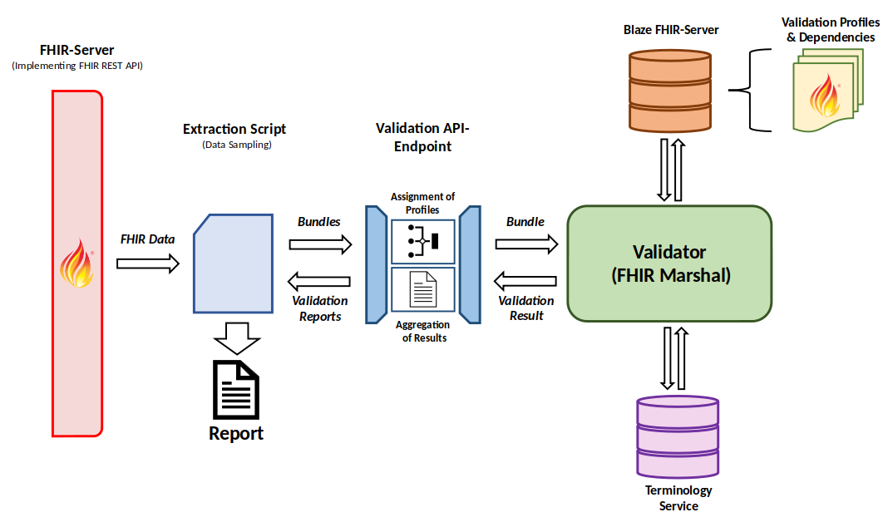

# fdpg-query-data-validation
This project provides a validation service in order to validate FHIR data
with respects to data quality, the requirements of the FDPG network and to 
ascertain what codes and values are most commonly used at the different sites.
Accordingly, the goal is not merely to assess data quality but also to 
facilitate mediation regarding how data has to be structured and has to be 
recorded for it to conform to the requirements of the FDPG platform.

## Deployment
This section will explore the deployment in an exemplary environment to not only provide information on
how to run this tool itself, but also on how to integrate it into existing software infrastructure.

### Step 1 - Installation Prerequisites:
If not already installed on your virtual machine download and install: 

#### Linux:
Docker (https://docs.docker.com/engine/install/ubuntu/) and the docker-compose plugin (https://docs.docker.com/compose/install/linux/).

#### Windows:
Docker Desktop with integrated docker-compose plugin (https://docs.docker.com/desktop/install/windows-install/)

### Step 2 - Clone this Repository to your virtual machine
ssh to your virtual machine and switch to sudo `sudo -s` <br />
Designate a folder for your setup in which to clone the repository, we suggest (`cd /opt`) <br />
Navigate to the directory and clone this repository from GitHub: ```git clone https://github.com/medizininformatik-initiative/fdpg-query-data-validation.git``` <br />
Navigate into the project directory: `cd /opt/fdpg-query-data-validation` <br />
Checkout the version (git tag) of the fdpg-query-data-validation you would like to install: `git checkout tags/<your-tag-name-here>` <br />

### Step 3 - Initialise .env files
The fdpg-query-data-validation requires an .env file for the docker-compose setup. If you are setting up the project new and have not done so yet execute the `bash initialize-env-file.sh`.

If you have set up the tool before compare the .env to the .env.default env files of each component and copy the additional params as appropriate

### Step 4 - Configure your validation tool

This project will perform an extraction and validation script against an existing FHIR Server running in an Docker Project-Context. If you don't have a FHIR server set up already. Follow the guidance in the **Deploying a FHIR server** section.
Change the following environment variables to match the configuration of the FHIR Server /.env according to the paragraph **Configuration of this README:

- FHIR_SERVER_URL
- PROJECT_CONTEXT

### Step 5 Download required value sets and code systems

The required ValueSets and CodeSystems for the validation are available here: [Confluence](https://confluence.imi.med.fau.de/pages/viewpage.action?pageId=218743453) 
Upload the value_sets_*.zip and code_systems_*.zip file to your server, unpack them and copy the ValueSets files to your value_sets folder and the CodeSystem files to your code_system folder respectively. 
Afterwards return to your installation dir.

```bash
sudo -s
mkdir /<path>/<to>/<downloaded>/<ValueSet>
cd /<path>/<to>/<downloaded>/<ValueSet>
unzip value_sets_*.zip
cd value_sets
cp * /opt/fdpg-query-data-validation/value_sets
cd /opt/fdpg-query-data-validation
```     

```bash
sudo -s
mkdir /<path>/<to>/<downloaded>/<CodeSystem>
cd /<path>/<to>/<downloaded>/<CodeSystem>
unzip code_systems_*.zip
cd code_systems
cp * /opt/fdpg-query-data-validation/code_systems
cd /opt/fdpg-query-data-validation
```   

If you are running this on a **Linux** machine you will need to grant read/write permissions for the directory in which
you want the generated reports to end up. By the default, the location would be **/opt/fdpg-query-data-validation/report**.

```bash
chown -R 1000:1000 /<path>/<to>/<reports>
chmod -R u=rwx /<path>/<to>/<reports>
```

### Step 6 Startup
To start the validaiton process run: `bash startup_and_run.sh`
This will perform an initial setup which takes about 5 minutes and performs 1 validation run.
The report is available at REPORT_LOCATION

If you want to rerun the validation process run: `bash run.sh`

To stop all container run: `bash shutdown.sh`

    
### Deploying a FHIR server
Before deploying this tool you need some FHIR server to which request can be made. This example will use
the [Blaze FHIR server](https://github.com/samply/blaze) which you can easily deploy using Docker with
the following commands:

```docker network create feasibility-deploy_default```

```docker volume create blaze-data```

```docker run -d --net=feasibility-deploy_default --name=fhir-server -p 8080:8080 -v blaze-data -e BASE_URL=http://fhir-server:8080 samply/blaze:0.18```

**NOTE:** Further documentation can be found [here](https://github.com/samply/blaze/blob/master/docs/deployment/docker-deployment.md)
**NOTE:** If you adjust the network name via the environment variable **PROJECT_CONTEXT** the network name would change
to *<project_context>_default* which you have to account for in the *docker network create* and *docker run* command

### Uploading data to Blaze FHIR server
Once the server is up and running you can upload your FHIR data to the server using the [FHIR REST API](https://www.hl7.org/fhir/http.html)
as implemented by every FHIR server. In the case of Blaze you can use the [blazectl tool](https://github.com/samply/blazectl).
It allows for easy data upload using the following command:

```blazectl upload <data_dir> --server <server_url>```

where **data_dir** is the directory your FHIR data in form of bundles (supported file formats can be found [here](https://github.com/samply/blazectl#upload))
and **server_url** is the URL of your FHIR server (in the case of this example it would be *http://localhost:8080/fhir*).

To obtain test data you can use the [KDS test data repository](https://github.com/medizininformatik-initiative/kerndatensatz-testdaten)
which you can grab by running 

```git clone https://github.com/medizininformatik-initiative/kerndatensatz-testdaten.git```

The repository contains the **Test_Data** folder which contains the FHIR bundles. To upload the contained data in this
example you would thus run

```blazectl upload kerndatensatz-testdaten/Test_Data --server http://localhost:8080/fhir```

to upload the data.

## Configuration
The environment variables can be configured in the **.env** file.

|                 Key                  |                                                                                                                                                                                                                  Default                                                                                                                                                                                                                   |                                                                                                          Value                                                                                                          |
|:------------------------------------:|:------------------------------------------------------------------------------------------------------------------------------------------------------------------------------------------------------------------------------------------------------------------------------------------------------------------------------------------------------------------------------------------------------------------------------------------:|:-----------------------------------------------------------------------------------------------------------------------------------------------------------------------------------------------------------------------:|
|     **VALIDATION_MAPPING_PORT**      |                                                                                                                                                                                                                    8092                                                                                                                                                                                                                    |                                                                              Port on which the service can be accessed as described above                                                                               |
| **STRUCTURE_DEFINITION_SERVER_PORT** |                                                                                                                                                                                                                    8090                                                                                                                                                                                                                    |                                                                             Port on which the Blaze FHIR server can be accessed externally                                                                              |
|     **FHIR_DATA_VALIDATOR_PORT**     |                                                                                                                                                                                                                    8091                                                                                                                                                                                                                    |                                                                           Port on which the FHIR Marshal validator can be accessed externally                                                                           |
|     **TERMINOLOGY_SERVICE_PORT**     |                                                                                                                                                                                                                    8093                                                                                                                                                                                                                    |                                                                                 Port of the terminology service used during validation                                                                                  |
|             **PACKAGES**             | "de.medizininformatikinitiative.kerndatensatz.laborbefund@1.0.7-alpha1 de.medizininformatikinitiative.kerndatensatz.person@2.0.0-ballot2 de.medizininformatikinitiative.kerndatensatz.diagnose@2.0.0-alpha3 de.medizininformatikinitiative.kerndatensatz.medikation@1.0.11 de.medizininformatikinitiative.kerndatensatz.prozedur@2.0.0-alpha5 de.medizininformatikinitiative.kerndatensatz.biobank@1.0.3 de.einwilligungsmanagement@1.0.1" | String containing packages to load into the Blaze FHIR server and provide the necessary StructureDefinition instances for validation from [Simplifier](https://simplifier.net/). By default the KDS profiles are loaded |
|         **FHIR_SERVER_URL**          |                                                                                                                                                                                                       "http://fhir-server:8080/fhir"                                                                                                                                                                                                       |                                                                      URL of the FHIR server from which the data that will be validated is obtained                                                                      |
|         **PROJECT_CONTEXT**          |                                                                                                                                                                                                             feasibility-deploy                                                                                                                                                                                                             |                                                                   The context in which both this tool and your FHIR server (data source) have to run.                                                                   |
|              **TOTAL**               |                                                                                                                                                                                                                    500                                                                                                                                                                                                                     |                                    Total number of instances for each relevant resource type (and unique LOINC code for Observation instances) which are pulled from the FHIR server                                    |
|              **COUNT**               |                                                                                                                                                                                                                    500                                                                                                                                                                                                                     |                                                                  Number of instances of a single page while paging through request to the FHIR server                                                                   |
|         **REPORT_LOCATION**          |                                                                                                                                                                                                                 "./report"                                                                                                                                                                                                                 |                                                               Location on the machine where you can find the generated reports after successful execution                                                               |
|          **FHIR_USERNAME**           |                                                                                                                                                                                                                                                                                                                                                                                                                                            |                                                                              User name for authentication via BasicAuth and OAuth if used                                                                               |
|          **FHIR_PASSWORD**           |                                                                                                                                                                                                                                                                                                                                                                                                                                            |                                                                               Password for authentication via BasicAuth and OAuth if used                                                                               |
|            **FHIR_TOKEN**            |                                                                                                                                                                                                                                                                                                                                                                                                                                            |                                                                                              Token used for OAuth if used                                                                                               |
|         **FHIR_HTTP_PROXY**          |                                                                                                                                                                                                                                                                                                                                                                                                                                            |                                                                                            URL of HTTP proxy server if used                                                                                             |
|         **FHIR_HTTPS_PROXY**         |                                                                                                                                                                                                                                                                                                                                                                                                                                            |                                                                                            URL of HTTPS proxy server if used                                                                                            |
|   **HTTP_PACKAGE_DOWNLOAD_PROXY**    |                                                                                                                                                                                                                                                                                                                                                                                                                                            |                                                                     URL of HTTP proxy server if necessary for downloading packages from simplifier                                                                      |
|   **HTTPS_PACKAGE_DOWNLOAD_PROXY**   |                                                                                                                                                                                                                                                                                                                                                                                                                                            |                                                                     URL of HTTPS proxy server if necessary for downloading packages from simplifier                                                                     |
|           **CA_FILE_NAME**           |                                                                                                                                                                                                                                                                                                                                                                                                                                            |                                            File name of certificate file you can place into the **certificates** directory and want to use for authentication if you require                                            |
|         **VERIFY_SSL_CERT**          |                                                                                                                                                                                                                    true                                                                                                                                                                                                                    |                        Indicates whether SSL certificates will be checked during requests to **your** FHIR server. **ONLY DISABLE THIS IF ABSOLUTELY NECESSARY AS IT INTRODUCES SECURITY RISKS**                        |
|      **FHIR_PROFILE_DIRECTORY**      |                                                                                                                                                                                                             "./fhir_profiles"                                                                                                                                                                                                              |                                                       Location of all the additional FHIR StructureDefinition instances you might want to use to validate again.                                                        |
|       **VALUE_SET_DIRECTORY**        |                                                                                                                                                                                                               "./value_sets"                                                                                                                                                                                                               |                                                  Location of the **expanded** ValueSet instances you might require if you want to validate against your own profiles.                                                   |
|      **CODE_SYSTEM_DIRECTORY**       |                                                                                                                                                                                                              "./code_system"                                                                                                                                                                                                               |                                                 Location of the **explicit** CodeSystem instances you might require if you want to validate against your own profiles.                                                  |
|   **VALIDATION_MAPPING_DIRECTORY**   |                                                                                                                                                                                                               "./value_sets"                                                                                                                                                                                                               |                                                                                              Location of the Mapping json                                                                                               |

## Architecture
This validation tool consists out of multiple components each of which is serving a unique purpose. Upon startup, the 
**Extraction Script** requests relevant resource instances from your FHIR Server and validates the data the obtained 
bundles using the tools hidden behind the Validation API-Endpoint.

Bundles of FHIR data send to the **Validation API-Endpoint** where individual resource instances are matched with
special FHIR profiles (if provided) if they match the associated conditions as provided by the 
**validation_mapping.json** file in the **maps** directory. After modification, they are sent to
the [FHIR Marshal](https://github.com/itcr-uni-luebeck/fhir-marshal) which serves as the validator. 

For facilitating this task, it draws required StructureDefinition instances from a 
[Blaze FHIR server](https://github.com/samply/blaze). The [KDS profiles of the MII](https://simplifier.net/organization/koordinationsstellemii/~projects)
and their respective dependencies serve as a baseline and are provided using the [FHIR populator](https://pypi.org/project/fhir-populator/)
tool. Additional StructureDefinitions to possibly validate against can be uploaded by placing the respective
files in the **fhir_profiles** directory.

Additionally, a lightweight [terminology server](https://github.com/paulolaup/termite) is included to enable the 
validation against value sets and code systems. Value sets can be added by placing files containing
the **expanded(!)** version into the **value_sets** folder and code systems by placing files containing
the non-summarized (meaning they contain all codes explicitly) version into the **code_systems** folder.

The OperationOutcome instances generated during validation are returned to the Validation API-Endpoint layer and
returned to the extraction script.

The Extraction Script then matches the obtained OperationOutcome instances to respective instances in the original
bundles which where acquired during the initial requests to your FHIR server. Thus, the generated report allows users to
check their data for issues after validation is done. The reports can be found under the path specified in the 
**REPORT_LOCATION** environment variable (see *Configuration* section).

**NOTE:** No data not initially present during the build and startup phase of this tool is retained in the system and
neither is data obtained from your server. However, data elements raising an issue will be most likely included in the 
report, if they contain a faulty UCUM unit or LOINC code!


